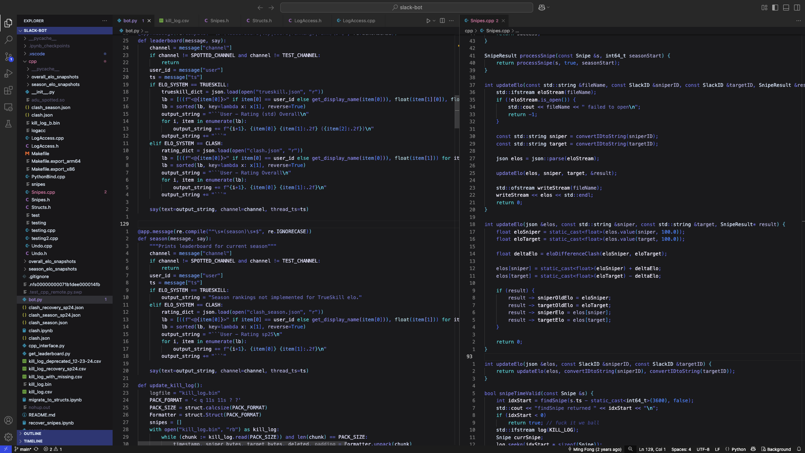

My personal color schemes for various editing tools

Jupyter:
Only works on jupyter 6.x, haven't tested this outside of the web interface on Chrome. To use this theme, copy `custom.css` to `.jupyter/custom/` (this needs to be on the machine hosting the server, therefore with port forwarding you will need the .css on the remote machine, not the one you're accessing with). May also 

VSCode:
Should suffice to copy the entire subfolder (in `vscode/`) to `.vscode/extensions` and reload the window before selecting the color scheme as usual. As of 5/4/25, only the text editor part has custom colors and not the terminal, since I never use VSCode's built in terminal.

Vim:
For Mac's default terminal, made by editing the 256 color palette values in Gruvbox (hex colors may not be accurate to the theme). Goes in `.vim/colors`

Current:
1) beyond-the-future.vim - based on the art from this playlist: https://www.youtube.com/watch?v=2uR-HUrZ1AE
2) yae-miko.vim - based on the character Yae Miko

Would also recommend using additional plugins (e.g. https://github.com/bfrg/vim-c-cpp-modern) to get better grouping for coloring.

TODO:
- add screenshots for jupyter
- upload terminal configs

Gallery:

  
  
Beyond the Future for Vim, C++

  
  
Beyond the Future for Vim, Python

  
  
Yae Miko for Vim, C++

  
  
Yae Miko for Vim, Python

  
  
Beyond the Future for VSCode, Python/C++

